A Handbook for Personal Financial Management Mao, Rubing Laurea **University of Applied Sciences**
Otaniemi A Handbook for Personal Financial Management Rubing Mao Degree Programme in Business Bachelor's Thesis January, 2017 Laurea University of Applied Sciences **Abstract**
Otaniemi Business Management Rubing Mao A Handbook for Personal Financial Management

Year 2017 Pages 41

The aim of the thesis is to introduce the concept of personal financial management and to explain the most common financial instruments. The study is motivated by three questions: (1) 
what is persona finance and how to management personal finance? (2) what are the common personal finance investment tools? (3) how to practice the tangible investment-real estate?

The majority personal finance literatures are writing about English speaking market. Very few English version can be found discussing about Finnish financial market. Therefore, the study of this thesis can advance the understand of Finnish financial market for personal finance. To answer the proposing questions, a serial of literature studies has been conducted, as well as mysterious customer visit in local financial institutions. The data used in the paper is from books, and online sources of authorities and national institutes.

The findings from the study are that individuals should learn how to practice personal financial management. They are ought to build up a health financial habit, for instance saving as early as possible for better financial achievements. During the personal financial management, individuals should always have goals both for long term and short term, and monitor their own performance, then adjust the plan for the financial management. Besides saving, individuals should also learn how to invest their asset in the financial market to build steady growth in wealth. To avoid risk, investors need to create a diversified portfolio, which means investors should run various financial instruments and invest in different industries. Besides the application of diversification, investors can also utilize the concept of hedging to reduce the risks. There is a wide range of financial investment tools. Each tool has its own characteristics and level of risks. High risk does not imply that a certain financial instrument is a bad tool. On the other hand, higher risk usually comes with a higher return on investment. The investment tool choice depends on investor's own preference. Investors need to allocate their assets in term of their tolerance of loss. In addition to the financial investment, there is another type of investment that is popular among investors-real estate. The real estate is usually the defense tool of financial investment. It keeps its value very well against inflation, and brings stable growth to investors. However, individuals need to be rational in real estate investment for the negative factors, such as unfavorable liquidity, and it takes long time before return on investment. 

The outcome of the thesis offers insight into personal financial management. It enlightens people's financial intelligence of running their personal assets. Investors can grasp some basic concept of personal financial planning. This paper is only a beginner guideline of personal financial management; it does not guarantee any return on investment. It takes time and capitals risk to practice and enhance the financial knowledge. It's a long-term process, but the result can be rewarding.

Keywords: personal financial management, financial instrument, derivatives, real estate

| Table of contents 1. Purpose of the thesis 6 2. Introduction 6 3. What is personal finance 6 3.1. Personal financial planning and process 6 4. Banking 10 4.1. The central bank 11 4.2. European Central Bank 11 4.3. Retail banking 11 4.4. Bank account 12 4.5. Deposit Insurance 13 5. Financial risk 13 5.1. Credit risk 13 5.2. Market risk 14 5.3. Liquidity risk 14 5.4. Political risk 14 5.5. Inflation and Deflation 14 6. Market Indicators 15 6.1. Consumer Prices Index 15 6.2. Harmonized Index of Consumer Prices (HICP) 15 7. Investment plan & Saving strategies 16 7.1. Time value of money 16 7.2. Rule of 80 17 7.3. Rule of 72/70/69.3 17 7.4. Diversification 17 7.5. Hedge 18 8. Derivatives 18 8.1. Interest rate 18 8.1.1. Compound interest 18 8.2. Bonds 19 8.3. Equity 21 8.4. Investment Fund 22 8.5. Futures 24 8.6. Options 24 8.7. Insurance 25 9. Real Estate 26 9.1. Mortgage 27 9.1.1. Hypo 27 9.1.2. Tips for choosing a mortgage 28   |
|----------------------------------------------------------------------------------------------------------------------------------------------------------------------------------------------------------------------------------------------------------------------------------------------------------------------------------------------------------------------------------------------------------------------------------------------------------------------------------------------------------------------------------------------------------------------------------------------------------------------------------------------------------------------------------------------------------------------------------------------------------------------------------------------------------------------------------------------------------------------------------------------------------------------------------------------------------------------------|

| 9.1.3. Managing Interest Risk - Interest Rate Hedging                                                                     |
|---------------------------------------------------------------------------------------------------------------------------|
| 9.1.4. Repayment methods ......................................................................................32         |
| 9.1.5. Steps for first-time home buyer                                                                                    |
| 9.1.6. Home Insurance                                                                                                     |
| Conclusion                                                                                                                |
| References ............................................................................................................38 |
| Figures .........................................................................................................40       |
| Tables                                                                                                                    |

| 10.   |
|-------|
| 1.    |
| 12.   |
| 13.   |

## 1 Purpose Of The Thesis

This thesis is a beginner guide for personal financial management. Introductions of some common financial instruments will be given in this paper. The study is based on the books, mysterious customer visit and call, as well as financial institute's online sources. 

## 2 Introduction

For kids, personal finance is all about the coins in the piggy bank. For adults, personal finance means so much more. If one's money stays in the current account without any financial activity, its value shrinks against inflation or other kinds of financial factors. In all history, people try to accumulate their wealth. Bad personal finance decisions can cause bankruptcy. So how can one accumulate personal wealth and make correct financial decisions? In this thesis, the author will explain about personal finance and current common financial products and activities.

## 3 What Is Personal Finance

Personal finance is an activity that involves all the individual financial decisions, which includes budgeting, saving, insurance, mortgages. When a person plans his personal finance, he needs to take a range of financial products and other personal factors into consideration. Personal finance has a huge influence on one's life and future.

## 3.1 Personal Financial Planning And Process

Financial planning is a way to financial security. It helps people to reach their personal goals. A financial plan sets a journey from present condition to the desired objective. The process of financial planning in general consists of five steps.

3.1.1 Step 1: gathering information and evaluating current financial situation A financial plan starts with a thorough evaluation of one's current financial circumstance. 

How much income does one have? How much expenses does one have? How is one's expenditure allocated? How much loan does one have? Before mapping out the steps, an individual has to see his or her whole financial picture, which demands him or her to keep track of spending carefully. In order to do so, he or she can take a few minutes every day to log in all the daily spending into a book, a computer program, or even a mobile application. (Magnarelli, 2011)

## - Net Worth And Balance Sheet

To view one's entire financial picture, an individual must find out his or her general situation by applying the concept of net worth. This concept helps individuals to categorize their assets and their liabilities. Asset is what one owns. It can be money, investments, real estates, cars, paintings, etc. Liability is what one owes, like mortgage, student loan, credit card debt, money borrowed from somebody, and so on. By subtracting the sum of liabilities from the sum of assets, one will get one's net worth.

Net worth= sum of assets-sum of liabilities
( 1 )
This formula shows the wealth that an individual has accumulated for the given period. If one's net worth is negative, then it means he spends more than what he earns. In this case, he is considered as insolvent. In order to make net worth more clear, a balance sheet is commonly used. (Bodie et al., 2003)

| Personal Balance Sheet                                                               |                |                        |             |
|--------------------------------------------------------------------------------------|----------------|------------------------|-------------|
| Assets                                                                               | Liabilities    |                        |             |
| Cash (Contingency Funds)                                                             | Secured Loans  |                        |             |
| Saving Bank Accounts                                                                 | ₹ 50,000       | Home Loan              | ₹ 19,00,000 |
| Fixed Deposits                                                                       | ₹ 1,00,000     | Car Loan               | ₹ 1,00,000  |
| Liquid Mutual Funds                                                                  | ₹ 1,50,000     | Unsecured Loans        |             |
| Investments                                                                          | Education Loan | 8 8 0                  |             |
| PF/PPF/Bonds etc.                                                                    | ₹ 5,00,000     | Personal Loan          | 880         |
| Debt/Bond MFs                                                                        | 8,3,00,000     | Credit Card Loan       | 80          |
| Gold, Gold MFs                                                                       | ₹ 3,00,000     | Other Payables         | ₹ 0         |
| Stocks, Equity MFs                                                                   | ₹ 10,00,000    | Loan from family/frien |             |
| ₹ 40,00,000                                                                          |                |                        |             |
| Real Estate                                                                          | Other dues     | 4 4 4                  |             |
| ₹ 20,00,000 ₹                                                                        |                |                        |             |
| Other Assets                                                                         | Total          |                        |             |
| Car                                                                                  | ₹ 4,00,000     |                        |             |
| Jewelry                                                                              | ₹ 2,00,000     | Net Worth              | ₹ 70,00,000 |
| Loan to family/friends                                                               | 00             | Assets                 |             |
| I 0                                                                                  |                |                        |             |
| Other receivables                                                                    | Liabilities    | ₹ 20,00,000            |             |
| Total                                                                                | ₹ 70,00,000    | Assets - Liabilities = | ₹ 50,00,000 |
| Table 1: an example of personal balance sheet (currency: Indian Rupee) (Gupta, 2013) |                |                        |             |

Table 1: an example of personal balance sheet (currency: Indian Rupee) (Gupta, 2013)
.

## Cash Flow, Saving, And Income Statement

As it is shown above, a balance sheet provides general information on one's financial situation. However, if an individual wants to trace his money and learn more details about his personal finance, he will need a tool called income statement. An income statement shows where one's money comes from and where it goes in an assigned period. An income statement is also called cash flow statement, in which income is the cash inflow, and expenditure is the cash outflow. (Bodie et al., 2003)

## 3.1.2 Step 2: Setting Financial Goals

Financial goals can be anything, such as a phone, a trip, a wedding, a house. In some countries, individuals also need to save for education and retirement. Individuals should know where they are heading before they set out. Besides defining a financial goal and attaching a price to it, individuals should also determine how much time they need to accomplish the goal. Every goal has its own time axis ranging from weeks to many years. (Magnarelli, 2011)

## 3.1.3 Step 3: Developing Financial Plan

A decent financial plan is well-designed, which matches one's personal goals. Flexibility, liquidity, protection, and tax are all ought to be taken into account. For example, Antti lost his job all of a sudden, and yet, he still had a mortgage to pay. He had some saving in the bank. 

However, his saving is under a fixed-term investment. In this example, flexibility is about planning for the unexpected. Antti should prepare some saving for periods of interrupted income. Liquidity means the availability of one's money when needed. Although Antti did have some saving in the bank, he couldn't access it. In Finland, Antti has Kela (the Finnish social insurance institution) support, protecting him from unemployment. In many unpredictable events, insurance can protect people from financial security threats. However, insurance costs. Therefore, a solid financial plan must contain sufficient insurance to keep off financial disaster. In the end, tax must also be considered in the financial planning. After all, part of one's income goes to the government. (Magnarelli, 2011)
When individuals have made their financial plan, they should think about the following questions.

- Do I have enough liquidity when emergency occurs? 

- Can I fulfill my debt obligations, like mortgage and credit card bill? - Do I save as much as I expect? 

Month's living expenses covered ratio can show how many months one can survive in the event of loss of all current. The living expenses do not contain tax and savings. A ratio of 3-6 is preferred. It suggests how many months one should get a new job.

ℎ8     = EFGHIJKL JMMHIM
JGGNJO OPQPGR HSTHGUPINKHM/WX ( 2 )

## - Personal Budget

A personal budget is an excellent tool for monitoring if the actual financial activity is going as one has planned and how the expenses are allocated. It can help individuals to spend less by arousing their awareness of additional spending. A personal budget is a finance plan that determines the distribution of future income towards spending, saving, and investing. A personal budget is made based on the past expenses and personal debts. When one is making his personal budget, he should try to keep it simple. A redundant personal budget tends to make a person to give up during the process. For instance, identifying the income and expenses does not need to be too specific, a user should categorize more generally. Flexibility is another tip that one should keep in mind. Because some spending does not happen every month. 

Like people may spend more money on ice cream in the summer time than in the winter. The variation in budgeting needs to be made accordingly. (Bodie et al., 2003)

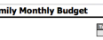

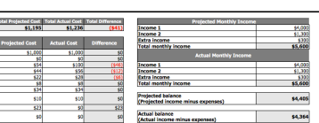

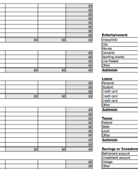

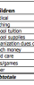

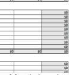

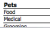

## 3.1.4 Step 4: Implementing The Plan

Financial plan is more like a map than a goal. It is a tool that leads to the goal. It is important to follow the plan. During the journey, one should keep tracking his income and spending, and meanwhile pay attention to the long-term goal. Based on the changes occurred in the journey, he can renew the route to the final destination. What matters the most is that he keeps moving towards the goal, not giving up in the middle if something happens. (Magnarelli, 2011)
3.1.5 Step 5: Reviewing the implementation and revising the plan As time goes by, things change. At the age of twenty, one may concern about getting a job; whereas he turns thirty, he cares about housing, or his new-born baby. Individuals must review their financial plans and re-evaluate their financial situation accordingly. (Magnarelli, 2011)

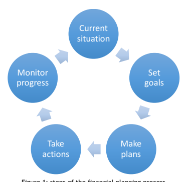

## 4 Banking

Generally speaking, a bank is usually the first place where financial activities happen. Cash service, transactions, investments, currency exchange, and loans are all operated in a bank. Banks are the financial intermediary between deposits and loans. They accept deposits from public and create credits, then lend directly via loans or indirectly to the capital markets. Besides national banks and commercial banks, internet banks are also joining the competition.

## 4.1 The Central Bank

The Bank of Finland is the Finnish central bank. It is a monetary authority which supervises all the banks operating in Finland. As a state owned property, it maintains currency supply, banking operations, and measures financial market and statistics. Additionally, it builds monetary policy which affects every individuals' financial activities. (Bank of Finland, n.d.)

## 4.2 European Central Bank

The European Central Bank is the central bank of 19 member countries of the European Union which have adopted euro as the currency. The capital stock of the European Central Bank is owned by the central banks of all 28 member states of European Union. The main task of European central bank is to define and implement monetary policies in the euro zone, which means to maintain the price stability. The European Central Bank tries to keep the inflation rate closely under 2%. In order to do so, the European Central Bank decides key interest rate which has an impact on European economy and price level in the euro zone. The European Central Bank also needs to ensure the payment system which can function fast and safely. It holds and manages reserves of foreign currencies, and conduct a wide range of statistic. It is also in charge of issuing euro bills. (European Central Bank, 2013)

## 4.3 Retail Banking

Categorized by customers, there are five types of banks: retail bank, private bank, business bank, corporate bank, and investment bank. Because the purpose of this thesis is focusing on personal financing, only retail bank will be discussed. Retail banks are also known as consumer banks. Their target customers are individual consumers and small businesses. Consumer banking services include providing transactional accounts and saving accounts, debit cards and credit cards, traveler's checks, mortgages, personal loans, time deposits and demand deposits, foreign exchange, fund and stock trading, etc. Individuals can access a retail bank via multiple channels. (Keown, 2013)

## 4.4 Bank Account

A bank account is offered by the bank when an individual has entrusted his or her money to the financial institution. Financial activities take place in the bank account. When financial transactions happen in a given period of time, the bank will inform the customer with the bank statement. There are two main types of bank account due to the financial activities: deposit account and credit account. The deposit account shows the credit that the account holder has entrusted to the bank. The credit account or loan account shows the amount a customer owes to the bank. A customer can deposit and withdraw with a deposit account. When one is paying his groceries, the financial transaction happens in his current or checking account, which is a transactional account under the deposit account. A saving account is the account that generates interest for customers. However, customers need to sacrifice the liquidity in exchange for the monetary return. Saving account includes a few kinds of accounts, and the typical one is called time deposit account. Time deposit, also known as fixed deposit, is a deposit that cannot be withdrawn until a specific time. It is opposite from the demand deposit, which doesn't have a maturity date. A fixed deposit provides a higher interest rate.

(Harrison, 2005)

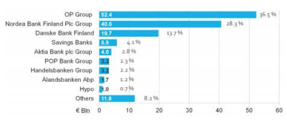

Things to consider when selecting an account:
- Interest rate: it affects the return on investment.

- Minimum balance: the minimum requirement to start a bank account. - Benefits and limitations: benefits and limits of the bank account. - Service fees: does gaining match the service fee.

- Transfer money: it affects liquidity. (Harrison, 2005)

## 4.5 Deposit Insurance

Deposit insurance is demanded by many countries. It covers full or partial loss if banks fail to pay back their debts when due dates come. The act of deposit insurance improves the financial stability. The deposit insurance institutes are mostly government-run. In Finland, the Financial Stability Authority is the deposit insurance organization. Since 2011, the coverage limit of insurance scheme has increased to 100,000 euro. (Finland Financial Stability Authority, n.d.)

## 5 Financial Risk

The financial risk is a general phrase covering various types of risk, such as credit risk, market risk, liquidity risk and operational risk. The financial risk means the potential of capital loss and uncertainty of return on investment. Risk is inevitable in financial investment. A good understanding of risk can help investors judge the investment carefully. Investors can allocate their assets and make better investment plans accordingly by determining how much risk one can take. (Keown, 2013)

## 5.1 Credit Risk

Simply put, credit risk is that borrower cannot pay back the money to lender. A lender could lose complete or partial of principal and interest, which might cause cash flow disruption.

From an individual perspective, he or she may fail to pay back his or her mortgage, or credit card bill. From a financial institute perspective, it fails to pay back the interest, invoice, employee's salary, etc. (Harrison, 2005)

## 5.2 Market Risk

The market risk has a very broad classification. Basically, it means the risk brought by market changes, like equity risk, interest risk, currency risk, commodity risk. When it comes to the risk, two factors need to be considered: probability and cost. What's the probability the risk may happen? What are the costs if the risk happens? Risk cannot be removed, but can be minimized. For investors, it is very necessary to enhance the possibility of gaining from market risk. 

- Equity risk: particularly refers to the stock investment. - Interest risk: is a typical risk for bond holder, as well as long-term fixed deposit investors. - Currency risk: is for those who participate in foreign currency and investors who possess a great amount of foreign currency.

- Commodity risk: for the commodity investors, the commodity risk contains the uncertainty of future market value and future income. The risk involves many factors, such as price, quantity, cost, and political issues.

## 5.3 Liquidity Risk

Liquidity risk means that investors cannot buy or sell an investment or assets as they wish in a given period of time. It affects both monetary flow and goods flow. For example, Antti goes bankrupt. He wants to sell his car so that he can pay the debt. But it is difficult to find a buyer during the time he wants to sell. With the time goes, the value of his cars decreases.

This is called liquidity risk. (Harrison, 2005)

## 5.4 Political Risk

Political risk is related with governmental actions and social changes. It impacts greatly on stock market and global trading. It is difficult to control; therefore, investors should always keep an eye on the political circumstances. (Harrison, 2005)

## 5.5 Inflation And Deflation

Besides those risks that have been mentioned above, inflation or deflation is another type of risk that threats investors. Inflation means the increasing price of goods and service over time, and as the consequence that the purchasing power of a currency decreases. For example: Antti usually spends 100 euros a week for grocery shopping. However, a year later, for the same number of goods, he needs to pay 105 euros. This is the phenomenon of inflation, with an increased rate of 5%. This phenomenon happens when a country has printed too much amount of money than its real wealth.

Deflation is a negative inflation, which implies that the inflation rate falls below 0%. Deflation is the declining price of goods and services. It happens during the economic recession. 

Phenomenon like, decreasing in money supply, government expenses, consumer demand, and business investment, all occur during the period of deflation. However, deflation has a positive impact on money value, which means that consumers can purchase more with same amount of money. (http://www.investopedia.com/terms/d/deflation.asp)
People normally think that leaving the money in the deposit account is risk free. Because without investing, they can avoid capital loss. However, if they do not take inflation into account, their savings will still be losing. Because the purchasing power decreases due to the inflation. Nevertheless, it does not mean that individuals should not put their money to the deposit accounts. In fact, the deposit account offers an easy way for emergency fund when capital security is the key. (Harrison, 2005)

## 6 Market Indicators 6.1 Consumer Prices Index

The consumer prices index is usually shortened as CPI. It is seen as the benchmark for inflation guide. It shows the price changes of a consistent base of products from year to year. The focusing products are the ones that consumers buy and use daily, such as bread, juice, shampoo, haircut, etc. (Statistics Finland, 2016)

## 6.2 Harmonized Index Of Consumer Prices (Hicp)

It is an indicator of inflation and financial stability to guide European Central Bank. It is conducted by each European Union state member. The HICP is used as the base of European index of Consumer Prices, which is weighted by the household expenses. The measuring prices are the prices of representative goods from both suburb and urban pricing patterns. 

(Harrison, 2005)

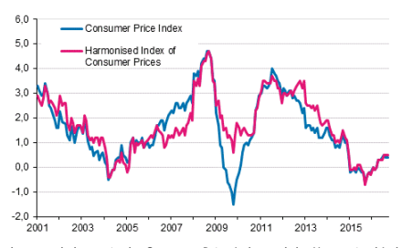

## 7 Investment Plan & Saving Strategies 7.1

Time value of money The concept of time value of money reflects the saying "time is money." The idea behind time value of money is that one euro a person has today is worth more than one euro he has in the future. When one needs to compare the amount of money, he has to adjust the value of money based on different time period. Value of money varies according to time. For instance, Antti won a lottery, the lottery company offered him two choices, one he could get one million now, or he could get two million in 20 years. Antti chose the first choice. Because the second choice only had 3.6% interest rate. If the bank interest rate is more than 3.6% and the inflation rate is high, then second choice is a worse deal. (Kewon,2013)

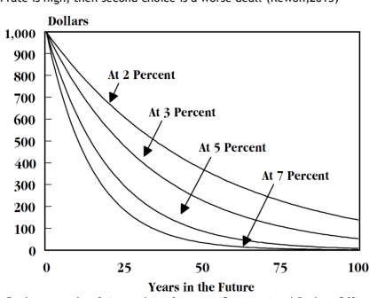

## 7.2 Rule Of 80

80 means the estimated age one can live. Nowadays, people can live longer with the help of science and medical development. Therefore, 80 can be replaced with 90 or 100. Rule of 80 means that when a man is getting older, the ability of taking risk is getting weaker due to the nature of losing working power. In this case, the result of the rule is the number of percentage of one's assets that is appropriate to invest in high risk financial products. For example, if Antti now is 55 years old. He assumes that he could live till 90, then he could invest 35% of his assets in the high risk financial investment. (Harrison, 2005)

## 7.3 Rule Of 72/70/69.3

The rule of 72 is a method for estimating the amount of years to double a certain value. The rule of 70 and the rule of 69 are used for the same purpose. The differences are that the rule of 72 is for less frequent compounding intervals and the number 72 has more divisors than 70 and 69; the rule of 69 and the rule of 70 are more accurate for the continuous compounding process. The number of 69.3 or 70 are the approximate number of the natural log (2) 
(ln(2) ≈ 0.693147). The equations of the rule of 70 are shown below: (Kewon,2013)

$$70$$

 = gh PGIHKHMI KJIH ( 3 )
If Antti has 10000 euros in the saving account with the interest rate of 2%, then it takes 35 years for him to double the savings. When used with the inflation rate, the rule of 70 can also estimate the amount of years a currency value will halve. For example: the inflation rate in Finland now is 0.4%, with application of the rule of 70, the euro will halve the purchasing power in 175 years in Finland.

## 7.4 Diversification

Investing all the money in one type of investment, especially high risk investment, investors could lose it all at once. To avoid this kind of failure happening, people can reduce the risks with a diversification strategy. Diversification means including various investments in one portfolio, with different risks, return on investment, and market stability. The concept is to contain a wide range of investment categories, meaning some may increase in value while others may not. In this case, investors can avoid major losses at one point of time. There are two diversifying approach: based on the investment types, and invested industry. The diversification in terms on investment type is known as asset classes. The asset allocation in the asset classes is demonstrated with pie charts, which show the variety and percentage of investments of the portfolio. A risk pyramid is used to show the risks among the asset classes. It is not suggested to rearrange the asset allocation frequently, but like once a year. The other diversifying approach is to spread investment in diverse industries. For example, investors should not invest only in housing industry stocks in the stock part of portfolio, so that they lose everything in stocks if a major disaster happens to the housing industry. (Magnarelli, 2011)

## 7.5 Hedge

A hedge is an investment for reducing the risk when the price movement going in an adverse direction. A hedge can be built through various kind of financial instruments, such as stocks, ETFs (exchange-traded funds), options, and futures. However, in hedging, when the potential loss is decreased, the potential gains are also reduced. (Bodie et al., 2003)

## 8 Derivatives

Derivatives are contacts of securities which have prices moving dependent on underlying assets, like stocks, bonds, commodities, interest rates, currencies, and market indexes. Derivatives can be traded either over-the-counter (decentralized dealer networks), or on an exchange (centralized regulated market, like NYSE and NAZDAQ). Derivatives can be utilized for hedging, speculation and having accesses to assets and markets. (Bodie et al., 2003)

## 8.1 Interest Rate

Interest rates have direct effect on how much organizations or individuals are charged for borrowing. The extent of the interest rate depends on the structure of the debt, which means the duration and timing of principals and interest payments. The characteristics of the debt structure indicates the maturity date, the principal repayment terms, and the provisions for prepaying the loan. In Finland, the central bank uses Euribor as the daily reference rate. The Euribor stands for the Euro Interbank Offered Rate. Since 2015, it is published by the European Money Markets Institutes. The Euribor interest rate is determined by the average interest rate at which the Eurozone panel of banks lend unsecured funds to other banks in the euro wholesale money market, or interbank market. Currently, the panel of banks consist of 23 contributing member banks. The contributors have the highest business volume in the euro zone money market, and they set short-term interest rates and use them to control company and individual spending. If both companies and individuals are spending far too much, then the banks will increase interest rates to deter us from borrowing. On the other hand, if companies and individuals are saving too much and not spending enough, the banks might decrease interest rates to encourage more borrowing and spending. (Harisson, 2005)

## 8.1.1 Compound Interest

Interest is counted in two ways: simple interest and compound interest. Simple interest formula is shown as follows:
 = × ×    ( 4 )
Compound interest formula:
  =  (1 +  )GNEpHK Fq rFETFNUPGR THKPFU ( 5 )
For example: Antti had 1000 euro saving. Bank offered him 5% annual interest rate. If he applied simple interest, he would get 500 euros as interest in 10 years. However, if he used compounding interest, he would get 628.9 euros in 10 years, which is 128.9 euros more. The more frequently the interest is compounded, the more interest is generated. However, every

| Interest        | Interest   |            |           |
|-----------------|------------|------------|-----------|
| Simple          | Compounded | Compounded |           |
| Timeline        | Interest   | Annually   | Monthly   |
| Initial Deposit | $1,000     | $1,000     | $1,000    |
| End of Year 1   | $1,030     | $1,030     | $1,030.42 |
| End of Year 2   | $1,060     | $1,060.90  | $1,061.76 |
| End of Year 3   | $1,090     | $1,092.73  | $1,094.05 |
| End of Year 4   | $1,120     | $1,125.51  | $1,127.33 |
| End of Year 5   | $1,150     | $1,159.28  | $1,161.62 |
| End of Year 6   | $1,180     | $1,194.06  | $1,196.95 |
| End of Year 7   | $1,210     | $1,229.88  | $1,233.35 |
| End of Year 8   | $1,240     | $1,266.78  | $1,270.87 |
| End of Year 9   | $1,270     | $1,304.78  | $1,309.52 |
| End of Year 10  | $1,300     | $1,343.92  | $1,349.35 |

Table 4: the differences among how interest is generated (Harrison, 2005)

## 8.2 Bonds

Bonds are financial instruments for issuing loans. It is a form of debt, in which the issuer is borrower or debtor who promises to repay the debt to the lender or creditor on the due date in the future. Governments and companies are the typical issuers of bonds. Credit rating agencies rate bonds based on the issuer's financial strength.

The date that issuers need to pay back the debt is called maturity date or redemption date.

The period to maturity ranges from 1 to 30 years. Long-term bonds tend to pay more than short-term bonds. Although, lenders need to sacrifice liquidity and the possibility of better returns elsewhere. Because lenders have to wait until the maturity date or find someone to purchase their bonds to turn the investment into cash. Holding a long term bonds, lenders may also face the risk of increase in inflation. If lenders have enough liquidity, bonds can be useful instruments to increase diversification in investment. As fixed-income investments, bonds provide capital preservation. (2011)
Interest, also known as the coupon, is paid generally at an agreed interval (like semiannual or annual) with a fixed rate. Interest rate is decided by the par/face value, which is the amount of the loan. Interest on most bonds is simple interest. The calculation of interest is to multiply the coupon by the par value by the number of years until maturity. (Harrison, 2005)
Yield is the return on investment. The higher yields are, the higher risk and longer maturity bonds will have. The risk with bonds is default, which means borrowers fail to pay back lenders. When counting the yield, investors should remember to deduct the annual management fee. (Harrison, 2005)

## 8.2.1 Corporate Bond

Bonds issued by companies are called corporate bonds. For companies, borrowing through bonds is one way of funding. The major difference among corporate bonds is whether or not the bond is secured.

## 8.2.2 Treasury Bond

A Treasury bond, also known as T-bill, are issued by national government. In Finland, it is issued by the State Treasury. The duration of bond is 5 years or 10 years currently. The treasury bond is one alternative for government to finance an unbalanced budget. Other approaches are selling assets, land, and raise taxes. Besides, treasury bonds, Finnish government also issues serial bonds and bonds in different currencies under the Euro Medium Term Note program.

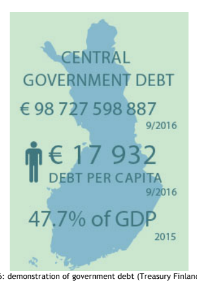

## 8.2.3 Municipal Bond

Municipal bonds are bonds issued by states, provinces, cities and other public agencies which fund public projects. The reason why municipal bonds are popular is because that the issuers are authorities. People think they are more reliable. Plus, the return on investment of municipal bonds are tax exempt. (Harrison, 2005)

## 8.2.4 High-Yield Bond 8.3 Equity 8.3.1 Securities 8.3.2 Ipo

High-yield bonds, also known as junk bonds, are sub-investment bond. It has high return on investment but with a low credit rating. Because high-yield bonds have higher risk of default. 

Issuers of high-yield bonds are usually start-up companies, and companies with high debt ratio. It is a good approach to diversify investment. (Bodie et al., 2003)
Equity is the difference between asset value and liabilities. Shareholders' equity is the net worth of a company. It is formed by investment and profit. It is a diversifying approach for investors who want to match or beat inflation over the long term. But unless a fund offers a guarantee, investors' capital is surely at risk with equities. (Harrison, 2005)
Securities is also commonly known as stocks or shares. It represents a part of the ownership of a company. The difference between stocks and shares is that stocks are fixed interest securities with a redemption date, while shares are securities with no fixed dividends or redemption date. In the stock market, companies that issue securities are public. Issuing securities is a way for companies to raise money. They sell part of the ownership of the company by issuing ordinary shares (equities). (Harrison, 2005) Compared with bank loan and bond, securities offer more financial freedom. Because companies are not required to repay any compensation if they do not run well. Therefore, shareholders should be prepared to take the potential risk that they might not get the money back. 

On the other hand, if companies were successful, the price of per share would go up, then shareholders could sell the shares for profit. Furthermore, large companies may offer dividends, which are part their companies' profits. Since large companies can barely offer investors a satisfying capital appreciation. Besides money, shareholders also get some say in the company management, like voting on certain decisions. (Harrison, 2005) An initial public offering(IPO) is issued when a company wants to sells stocks to the public for the first time. A company can decide how many shares it will sell and how much a share costs. After IPO, if an invest would like to hold a company's shares, he or she has to purchase the shares from other investors. Trading shares can only occur in the stock exchange. (Steven E. Bochner, 2010)

## 8.3.3 Nasdaq Nordic

Nasdaq Nordic is the subsidiary company of Nasdaq (National Association of Securities Dealers Automated Quotations) Incorporation. It has 7 stock exchanges, and Helsinki Stock Exchange is one of which. The Nasdaq Nordic performs business activities in the following markets: Nordic Market (Helsinki, Copenhagen, Stockholm, and Iceland), Baltic Market (Riga, Tallinn, Vilnius), and First North (small and growing companies in Nordic countries), Fixed Income (like government and corporate bonds) and ETF/ETP (Exchange Traded Products/Exchange Traded Funds). Nasdaq Nordic trades shares, indexes, bonds, options & futures, ETF/ETP and funds.

(Nasdaq Nordic, n.d.)

## 8.3.4 Market Index

The index is a weighted average reprehensive sample of the market. Index value assists investors to tack the changes happen to markets over long period. Investors can also use index as a benchmark to compare with a stock or own portfolio performance. There are serval types of index, such as country indexes, regions indexes, and investment class indexes. In Finland, the Helsinki stock market has the index of OMXH25, which consists of 25 most traded stocks. The maximum weight of a single stock is up to 10%. (Harrison, 2005)

## 8.4 Investment Fund

An Investment fund is like a pool of money that numerous investors buy a share of. Each investor gains the ownership of purchased shares. Experienced fund managers run the fund management, which includes offering better return on investment and controlling risks. Fund provides investors a wide range of opportunities and cheaper investment fees. Fund can be categorized roughly by when investors can redeem the shares (closed ended or open ended),
and what type of investment the fund invests.

## 8.4.1 Mutual Fund

A mutual fund is composed of many different types of investment. Investors do not directly own the stock and bonds within the fund, but they own shares of the fund they hold. Therefore, mutual funds grant investors to have accesses to various kinds of stocks and bonds than they could afford themselves. The diversification of mutual funds can lower the investment risk. Mutual funds are managed in both passive and active ways. Passive management means that mutual funds automatically invest in correlation with a major index. These funds are namely index funds. Active management means that a manager or a management team chooses what to invest in and when to invest. Most mutual funds have minimum initial investment requirements. The price per share of a mutual fund is known as NAV, or Net Asset Value, per share. NAV is calculated daily, based on the closing prices of all the holdings. There are four main types of funds: - Equity funds - invest in stocks. - Bond funds - invest in bonds. 

- Money-market funds - invest in short-term debt, including some Treasury bonds and CDs. - Asset-allocation funds - invest in some combination of stocks and bonds

## 8.4.2 Etf (Exchange-Traded Fund)

ETFs are a hybrid financial instrument. It is like stocks that are traded on an exchange. Investors can buy and sell throughout the day. Therefore, the price of ETFs changes in terms of market, whereas the price of a mutual fund is set only once a day at the end of the trading session. At the end of trading day, the new NAVs of portfolio is calculated based on the holdings of ETFs, just like how the NAVs of mutual funds is done. Investors can track ETF prices online by name or symbol like what they do to stock. ETFs are based on indexes, which means that ETFs invest a bunch of stocks or bonds which compose of an index, or a business sector from abroad. ETFs are diversified within a sector or a country. The total expense ratio (TER) of ETFs is lower than mutual funds. (Keown, 2013)

## 8.5 Futures

A future is an obligating financial contract that buyers and sellers agree to buy or sell commodities or financial instruments at a pre-decided price and date in the future. The price, quality and quantity of the products are fixed and specified at the time when the contract is made. A futures contract is a tool for controlling risk because it allows the parties in the contract to predetermine the factors which may cost significantly in the business in the future, and therefore benefit from it. For example: Antti has a shop that sells product A. To make product A, Antti needs product B as ingredient. When product B costs 1 euro he can make 2 euros' profit, and the seller of product B can also make profit. In the region, there opens another shop also sells product B, so the product B price goes down 50%. The seller of product B 
loses money, whereas Antti makes more profit. Later, some crises come, the production of product B decreases, thus the price of product B goes up to 4 euros. However, when product B costs 3 euros, Antti loses money. To prevent this kind situation happens, Antti and the seller of product B signed a future contract which agree that product B will be sold at 1 euro on a date with a certain amount. Futures have also a cost-cutting mechanism, especially in index tracking funds and funds in which have fast changing allocation of huge asset. (Keown, 2013)

## 8.6 Options

An option is a type of financial contract without obligation. The parties in the option contract are called option writer(seller), and option holder(buyer). An option contract only gives the holder the right, but not the obligation, to buy(call) or sell(put) a specified financial asset at a pre-agreed price, called strike price, on or before a given date, also known as exercise date. The worst scenario of trading option is that investors lose all the premium he or she paid.

## 8.6.1 Call Option

A call option is a financial agreement that gives buyers the right, but not the obligation to buy financial assets at a specific price within a period. Investors make profits when the price of asset increases. When the strike price of call option is lower than the market price, it is called in the money. When an option is in the money, it means the option is worth exercising. In other words, it has the potential to make profit.

## 8.6.2 Put Option

A put option is opposite to a call option. The buyer of a put option has the right, but not the obligation, to sell the financial asset at a specific price within a specific time. A put option is in the money when the strike price is above the market price. When the market price is above strike price, it is called out of money. (Magnarelli, 2011)

## 8.7 Insurance

Life is full of uncertainty. People need to mitigate the disasters that happen to them. Some risks can be taken, for instance, buying an apple computer without apple care. Some risks may cause a lot of money; therefore, people need insurance companies to share the risks with. By purchasing an insurance, the policyholder and the insurer bind the legal contract against risks. The insurance is made to be a cost-efficient instrument for protecting against worst scenario, such as: costly medical bills, damage or loss of homes, traffic accidents. Some insurances pay regular expenses, whereas the purpose of other insurances is to minimize the expenses. The policyholders pay the premium which is the payments have to be made for the insurances. Premium is related to the potential amount of risks. If the chance of policyholders filing claims are high, the premium price will also be higher. People can decrease the premium by decreasing the risks, like installing a security camera at home if a policyholder bought a house insurance. A policy usually has a limit for coverage, and the higher coverage means higher premium. An insurance policy also contains exclusions, which are the conditions that policies do not cover. An insurance deductible is the amount of money that a policyholder has to pay before an insurance will bear part of costs. A higher deductible implies lower premium. Once the issues that policyholders are insured happen, policyholders can file claims along with receipts and proof, then insurance companies will pay. (Magnarelli, 2011)

## 8.7.1 Life Insurance

A life insurance is to eliminate the financial burdens by providing a certain amount of income when family income earners die. The target customers are those who have family members depending on their income, like parents who have young children, adults who have old parents. When the insurance is issued, the policyholder can name the beneficiary who can inherit the money. There three factors which have the impact on a life insurance policy: the type of policy, the risk, and the death benefit. Generally, there are two types of life insurance: term life insurance and permanent life insurance. One has a limit time, and the other does not expire. For the term life insurance, applicants should consider the appropriate time, like when will kids be independent, how much loan is left. The risk means the health risk that applicants current face. The death benefit is the money that beneficiary will get. The future expenses decide the right benefit, but it should cover major loans, and living expenses, and of course, the funeral costs.

## 8.7.2 Medical Insurance/Health Insurance

Individuals can get medical insurance or health insurance though companies, government, or directly from insurance companies. The group health insurance purchased through companies is usually the cheapest. The government based social security, Kela, is for all Finnish citizens and legal residents. However, the long queueing line made government social security less appealing. For those who don't want to wait for the long queue and do not have the access for the company health insurance usually end up buying the private health insurance directly from the insurance companies. Those insurances tend to be more expensive, because there is no group rate and individuals have to pay the entire premium by themselves. Premium charged is based on the age, and medical status and risks factors. The medical insurance has the coverage of doctor visits, hospital stay, surgeries, ambulance service, medical tests and prescript medicines. It also covers some preventive health check. However, dental and visual are normally not included in the health insurance. (Magnarelli, 2011)

## 8.7.3 Purchased Life Annuities

Purchased life annuities from insurance companies offer regular income for life in return for a lump sum investment. The annuity rate depends on factors, such as life expectancy and prevailing interest rates. Women have lower income in return for the same level of invest because they tend to live longer than men. People who have worse health condition may have higher income for that they may live shorter than healthy people. A home income plan is one of the choices for some elderly people who may want to exchange their home for incomes that can pay bills for the rest of their life. They can live at their home, but after their death, insurance companies may take part of the shares of their homes. The annuity payments are not tax-free. A part of the income is considered as a return on investment. The interest is taxed but it decreases with age. (Harrison, 2005)

## 9 Real Estate

Real estate is a tangible property. It is the land that an individual owns. However, real estate is more than that. The buildings on the land, the natural resources, such as minerals, plants, animals, are all included to the real estate category. 

In daily life, when people say real estate, they mostly mean houses or apartments. People invest in real estate mainly for getting a home to live in, because monthly instalment is comparable to monthly rent. The difference is that instead of paying rent to others, mortgage payers accumulate wealth. Additionally, in Finland, first-time home buyer can deduct 30% of the loan interest to tax for 10 years. Besides that, some invest in real estate to expect appreciation in the future, so that they can re-sell the properties to make profit.

People also purchase commercial properties with the goal of renting it out to make extra income. The rent provides the investor with a steady cash flow and is expected to keep pace with inflation over time. However, it can take a long time before the capital investment is paid off. (Harrison, 2005) The real estate value is determined by many economic factors, but primarily it is based on demand. The location of the real estate decides the demand: a studio in the city center is very likely more valuable than one in the suburb. The properties nearby office blocks, or reputed school districts tend to be more expensive than those similar ones in the region with less desirable features, such as high unemployment rate, close to refugee center. According to the articles published by *Helsinki Uutiset* in 2014, the average home size in the Finland is 34 m2 for a studio and 55 m2 for a two-room flat. The cost of a two-room flat for a small family is around 358 000 € in Kamppi in 2016. It is difficult for most of the buyers to pay the whole price from their saving, with such a big sum. Here is where mortgages come in.

## 9.1 Mortgage

A mortgage is a secured loan which takes the property as the borrower's collateral. It means that if a borrower fails to pay his or her debt as agreed, then the lender can take the property in possession and sell it for recouping the loss. If a borrower keeps paying back his or her mortgage, he or she can continue having the property. The date that the borrower pays back the loan, the property will no longer be collateral, therefore the lender does not have any right to the property. The mortgage deed is the legal contract between the borrower and the lender. (Magnarelli, 2011) In Finland, based on the law, a real estate buyer must save at least 10% of the selling price, and then take a mortgage to pay for the entire price (Nordea, n.d.). The buyer owns the part he or she purchases without mortgage; the bank that provides the loan owns as much of the home as is mortgaged. The buyer pays the monthly instalment to the mortgage to build his or her equity, or ownership in the home. If later, the buyer sells the house for as much as he paid for it, he gets back all the equity he has built and the mortgage is paid off. If the buyer sells for less than what he paid, he has to pay off the loan first, then take his share. If he sells for more than he paid, he still needs to pay back the rest of the mortgage, and then he gets to keep the amount he invested, in addition to the profit. 

## 9.1.1 Hypo

People mostly go to banks to get mortgage. However, they are not the only sources. In Finland, the credit institute, Hypo, also provides mortgage loans. It is the only credit institute specializing in housing finance. Hypo's financial products include deposit accounts, credit cards, loans for home purchase, as well as for home renovation. (Hypo, n.d.)

## 9.1.2 Tips For Choosing A Mortgage

In Finland, there is no such a job like mortgage planner, whose duty is to ensure individuals to select the most suitable mortgage for their circumstances, and to avoid difficulties later. People must make the choices all by themselves. Hence, it is important to learn how to pick the right mortgage. Plus, whether a house or an apartment is affordable, price is not the only determining factor, but also on the specifics of the mortgage. After all, mortgage is the real price that a home buyer pays for. When choosing a mortgage, home buyers should consider following factors:
- How long should the mortgage last? - What kind of interest rate should it be? - Which mortgage repayment method should it be?

9.1.2.1 *Conventional	and	Government-Backed	Mortgages* There are two kinds of mortgages based on the way of security: conventional and government-backed. Conventional mortgage is the loan offered by a bank or a credit institute, like Hypo. It is secured by the property being purchased. If a mortgage borrower defaults on the loan, the lender takes the possession of the property, sells it, and recovers the funds owed.

(Magnarelli, 2011) A government-backed mortgage is insured by the government. It is also one of the financial products offered by the traditional lenders. Borrowers go to the lenders and can choose the government-backed mortgage and apply like the way how they apply for other loans. In Finland, Asuntosäästöpalkkio(ASP), housing savings premier in English, has been an affordable state-subsidized mortgage for first-home buyers who are between 15-39 years old.

9.1.2.1.1 Advantage	of	ASP: - Lower interest than other housing loan. - When interest rate is higher than 3.8%, government pays part of the interest during the first ten loan years. The max amount of interest-subsidized loans is: 
Ø Helsinki - 180 000 euros Ø Espoo, Vantaa and Kauniainen - 145 000 euros Ø Other municipalities - 115 000 euros
- 10% savings of the housing price. - 1% annual deposit interest rate, plus max six years of 4% bonus interest, which are taxexempt.

- No asset transfer tax is charged if borrowers are between 18-39 years old at the time of purchase.

- Borrowers get a partial state guarantee as additional collateral free of charge.

- Borrows can have instalment-free years during the loan period.

9.1.2.1.2 Disadvantages	of	ASP:
- Loan period is 10-25 years. - Two years or eight quarters minimum saving time. - Each quarter saving is between 150-3000 euros.

- If the borrower needs to move abroad, his or her home purchased with ASP can be rented for only two years.

- Bonus interest is paid only when home purchase is completed. (Nordea, n.d.)

## 9.1.2.2 Fixed-Rate	Mortgages

A fixed-rate mortgage means that the mortgage has a fixed interest rate for a period. The period can be 3, 5, 10, 15 years, depending on banks' policy. Borrowers do not need to concern about changing interest no matter what happens to the market. If mortgage interest rates are low, a fixed-rate mortgage locks in the low interest rate for a certain amount of time. Every month, the amount of principal and interest changes from payment to payment, however, the total monthly payment stays the same. Therefore, with fixed-rate mortgages, it is easier for borrowers to make budgets. Borrowers are also protected from monthly payment increases if the interest rates rise. Based on a mysterious customer call with S Pankki in 2016, it is not suggested to take a fixed-rate mortgage for first-time home buyers, because in the capital region, home buyers only stay in average for four years in their first apartment. Therefore, if home buyers choose fix-rate interest mortgage, they may face cancellation fees and penalties if they pack back the mortgage early. (Nordea, n.d.)

## 9.1.2.3 Adjustable-Rate	Mortgages(Arm)

An adjustable-rate mortgage means that the mortgage has a fluctuating interest rate according to market condition. The initial interest rate is fixed for a short term, after which it resets periodically. Adjustment frequency, which means the time between interest rate reset, can be every month, every year, even every decade. Borrowers pay the fully indexed interest rate, which is the combination of benchmark interest rate, known as index, and margin. The index for a mortgage can be the bank's own interest rate, prime rate, or Euribor 12 month, etc. The margin that borrowers agree to pay is called net interest margin. It is a performance measurement that examines the success of investment. Borrowers prefer adjustable-rate mortgages in a falling interest rate environment. However, the downside is that when interest rates rise, borrowers have high risk of default. (Kewon, 2013)

## 9.1.2.4 Hybrid	Adjustable-Rate	Mortgage

A hybrid adjustable-rate mortgage is a mix of fixed-rate mortgage and adjustable-rate mortgage. In some banks, it is called callable long term fixed interest rate mortgage. It usually has an initial fixed-interest rate period, followed by an adjustable-rate period. When the fixed interest rate period ends, the interest will be set by the combination of index rate and margin. For example, in Nordea, customers can take a long term fixed interest rate up to 15 years. After 15 years of fix interest rate period, the interest rate will be changed to Nordea prime rate plus margin. The date when the interest rate is changed from fixed rate to adjustable rate is referred as reset date. When the reset date comes, borrowers may face a huge increase on mortgage payment. (Nordea, n.d.)

## 9.1.3 Managing Interest Risk - Interest Rate Hedging

An interest-bearing asset, like a loan, has the potential interest rate risk because of changing market conditions. Interest rate risk can cause a series of problems in the financial market, therefore interest rate risk management is extremely important. It is recommended that borrowers should take securing repayment into consideration before applying mortgages. Interest rate hedging can help to avoid rising interest rates. In Finland, Nordea offers interest rate hedge instruments whose duration may vary according to customer's need. (Nordea, n.d.)

## 9.1.3.1 Interest	Rate	Cap

Interest rate cap is an interest rate hedge instrument that ensures reference interest rate on loans will not exceed a certain maximum level, the interest cap, when interest rates start rising. If the Euribor rate is lower than the interest rate cap, the loan interest follows the Euribor. Borrowers can be relieved from the fluctuating market condition, and take advantage of the low Euribor interest rate. Borrowers can make changes to loan repayment schedules under the same initiated principal due to the changes of interest rate. Borrowers can also pay interest rate cap fee to the loan principals. The interest rate cap fee varies daily. The validity of the interest rate cap is between 3-10 years. The interest rate cap is suitable for those who want to pick a short reference rate, and want to secure part of the loan against fast changes in reference rate. (Nordea, n.d.)

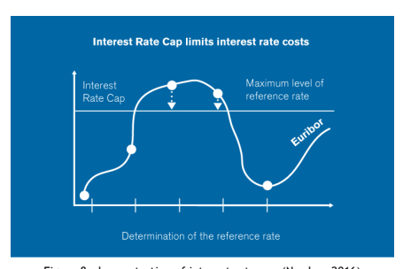

## 9.1.3.2 Interest	Rate	Collar

Interest rate collar is also an interest rate hedge instrument, like interest rate cap. However, the difference is that interest rate collar has a minimum level of reference rate as well. During the validity of the interest rate collar, the interest rate will not exceed the maximum level. If the interest rate falls below the minimum level of interest rate, borrowers pay the minimum level of interest rate. There is no fee charged on the interest rate collar. The minimum loan period for applying the interest rate collar is 10 years. The maximum and minimum level of reference rate are determined at the time when borrowers draw down the initial instalment of loans. Interest rate collar suit those who prefer the possibility to make flexible changes in loan repayment schedule, and do not want to pay additional fees or cancellation costs. (Nordea, n.d.)

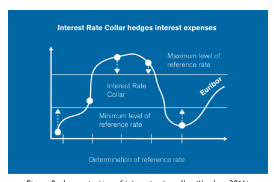

## 9.1.4 Repayment Methods

The monthly loan instalment should be maximum 35% of borrower's monthly net income. The amount of monthly instalment should be determined in a way that borrowers can still save some money for future needs. The mortgage repayment is made up of principal and interest. Moreover, both interest rate and repayment method affect interest amount. There are a few ways of repayment. To choose the right method, several factors need to be taken into considerations:
- Are you the certainty type of person who want to know exact repayment amount? - Are you the flexible type of person whose circumstances might change soon? - Do you want to pay back the loan within a certain period?

- Do you have the flexibility that loan terms may get longer? - Do you have the flexibility to make extra repayment anytime, which means pay back the loan faster?

## 9.1.4.1 Variable	Annuity

Borrowers know exactly when the loan period ends. Monthly instalment changes if interest rate level changes, therefore, borrowers should have ability of handling the possible rise of interest rate level. Instalments are same and low in the beginning of the loan period. Instalments changes if interest rate changes. The proportion of principal is low at first, but it increases during the term of loan as less interest produces. (Nordea, n.d.)

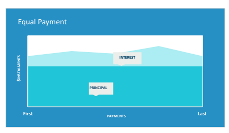

## 9.1.4.2 Fixed	Equal	Payments	(Table	Repayments)

Borrowers know exactly how much monthly instalment should be. However, the loan term changes due to the change of interest rate, which means if the interest rate increases, the period of loan will be extended; if the interest rate decreases, then the period of loan will be shortened. Borrowers pay more interest than principal at first, which implies there is not much equity built in the beginning. The amount of interest is always at least equal to the amount of principal. (Nordea, n.d.)

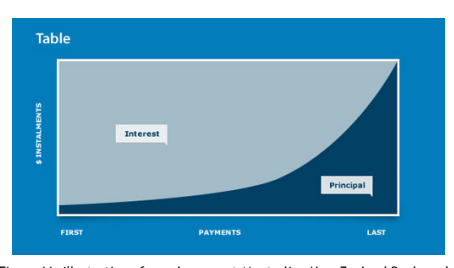

## 9.1.4.3 Equal	Instalments	(Straight	Line	Repayments)

Borrowers make larger payments at the start. Principal is divided equally over the period of loan, and interest is applied to each principal. Because borrowers pay principal every month, therefore principal is reduced gradually, hence less interest will be produced. Borrowers can build more equity in the beginning. (Nordea, n.d.)

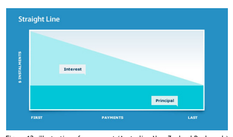

## 9.1.4.4 Bullet	Repayment	(Interest	Only)

This is method is made for temporary financing. Borrowers pay the entire principal in one go, with a few interest payments within the loan period. Bullet repayment suits those who expect to have some capital achievement. (Nordea, n.d.)

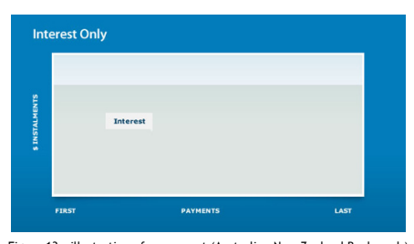

## 9.1.4.5 Early Repayment	(Prepayment)

The early repayment means that borrowers to make early payments which are applied to the principal, thus reducing the amount of interest. Borrowers need to contact banks for rescheduling monthly instalment if they want to make early repayment. Early repayment can cause high monthly instalment. Many mortgages restrict early repayment by limiting the amount that can be paid, limiting the minimum years of holding the mortgage, or charging a penalty for early repayment. (Nordea, n.d.)

## 9.1.5 Steps For First-Time Home Buyer 9.1.5.1 Do	The	Assessment

First, home buyers must have reasonable stable income. Banks only check their monthly net income. Then, they should count their monthly expenditures. From net income and expenses, home buyers can assume how much mortgage instalment they can afford. In addition, they should also take monthly maintenance fee into account. Moreover, home buyers need to consider questions like if their living standard will be degraded after mortgage repayment? Can they still afford to shop, dine, or travel? Can they still save? Based on the monthly budgeting, finally, home buyers can draw an assumption about how expensive houses or apartments they can afford.

## 9.1.5.2 Apply	For	The Loan	Promise

A loan promise is an agreement to show that a bank promises to finance the purchase of a home on agreed terms. In Finland, it is recommended to apply for a loan promise before going on a house viewing. After obtaining a loan promise, a home buyer approximately knows the price he or she can offer to the housing agent or house seller. A loan promise can accelerate the sale and loan decision process, and is valid for one month. After validation, home buyers need to contact banks to issue new ones.

## 9.1.5.3 Meet Bank	Staffs

Nowadays, home buyers can hand in loan application online, and set up a loan negotiation meeting. Before the meeting, home buyers should prepare the estimated budget, information of current loan and credit, total savings, the information of house or apartment that they are interested in, working contract, pay slip, and personal id. In the meeting, bank staff will discuss some topics such as: what kind of the home buyers want to have; what is the suitable repayment schedule; what security buyers can offer; What interest and interest hedge instrument buyers should take; how to ensure the payment if accidents happen, etc.

## 9.1.5.4 Transfer	The	Payment

When home buyers find their target and their offer get accepted, they should contact banks a few weeks in advance before the transactions. Some banks may want to have a valuation check on the property to see if it is priced correctly. Home buyers need to sign and deliver needed documents, and give the banks staff contact information to the real estate dealer, who looks after the legal side of the process. Banks will confirm again before drawing down the mortgage. (Nordea, n.d.)

## 9.1.6 Home Insurance 9.1.6.1 Renter'S Insurance

The renter's insurance is another type of property insurance. It is similar to a homeowner insurance, and has coverage for both property and liability damages within the rental property. The property protection includes furniture, electronics, or other properties. The protection is valid if the damage or loss is caused by natural disasters, crime, or fire. The insurance company will pay to buy the replacement. The renter's insurance also offers some short-time living expenses if insurance buyers have to stay elsewhere because of damage to the property. 

Liability part in the policy can protect insurance buyer from legal responsibility. For example, somebody get hurt in his or her property, or insurance buyer break somebody else's property. 

The premium is affected by location of property, age and size of buildings, and coverage of the policy. When accidents happened, insurance buyers need to file claim forms, along with the proof and evidence related to the accidents. (Harrison, 2005)

## 9.1.6.2 Homeowners	Insurance

The homeowner insurance is a property insurance for protecting homes against damages. A 
typical homeowner insurance policy covers property and liability. The property part includes the protection of house structure, and damage from non-human caused disasters, for instance: thunder strike, wind, fire, and, explosion. Homeowner insurance also has a coverage of the structure of the home and the property around it. However, sabotages by earthquake or flood are not included in the normal homeowner insurance. Homeowners have to insure those risks in other insurances. The liability part insures the legal responsibility just like renter's insurance. For example, one's pet bites his or her neighbor. Besides those mentioned above, some homeowner insurance also provides pet policy against illness or accident.

(Harrison, 2005)

## 10 Conclusion

This thesis has introduced the idea of personal financial management for the financial outsiders. The paper has gone through the introduction of personal finance management and its process, some basic banking concepts and market indicators that have the strongest impact on individual's life, introduction of most common derivatives for private investment, and real estate investment. The studies were conducted via methods, such as books, internet sources and mysterious customer visits and calls. The most challenging part is the limitation of English source in Finnish financial market. From the thesis study, it has been found that individual investors should have an investment portfolio that includes a wide range of investment to even out risk so that they can achieve a steady growth in personal wealth. In brief, personal investors should start saving as early possible, plan and monitor the expenses, build an investment portfolio base on the risk they can endure, and in the end, diversify the investment. Besides the financial investment, real estate investment plays a crucial part in personal financial life. It secures the fundamental human needs - shelters - and it also may bring value to personal wealth. There is a saying "no pain no gain" which gives a perfect definition of personal finance. Here "pain" can mean two things: loss and effort. The financial market is always full of risks that investors need to be aware of, and do not let the present profit to cloud their judgement. Individuals must work hard to develop their financial skills and experience so that they can accumulate the wealth they desire. 

## 11 References

Australian New Zealand Bank, n.d. *Home loan repayment types*. [Online] Available at: 
http://www.anz.co.nz/personal/home-loans-mortgages/manage-existing-mortgage/homeloan-repayment-types/ [Accessed 7 December 2016]. Bank of Finland, n.d. *Bank of Finland*. [Online] Available at: http://www.suomenpankki.fi/en/suomen_pankki/Pages/default.aspx [Accessed 7 December 2016].

Bodie, Z., Kane, A. & Marcus, A.J., 2003. *Investments*. 5th ed. The McGraw-Hill. Congressional Budget Office, 2003. *The Economics of Climate Change: A Primier*. [Online] Available at: https://www.cbo.gov/sites/default/files/108th-congress-2003-2004/reports/0425-climatechange.pdf [Accessed 7 December 2016].

European Central Bank, 2013. [Online] Available at: 
https://www.youtube.com/watch?v=TAlcFwGIQBg [Accessed 7 December 2016].

Finanssialan Keskusliito, 2015. [Online] Available at: 
http://www.finanssiala.fi/en/material/Finnish_Banking_2015.pdf [Accessed 7 December 2016].

Finland Financial Stability Authority, n.d. *Deposit Guarantee for Individuals*. [Online] 
Available at: http://rvv.fi/en/deposit-guarantee-for-individuals [Accessed 7 December 2016]. Gupta, S.C., 2013. *Finlosophy*. [Online] Available at: 
http://www.finlosophy.com/2013/10/25-personal-balance-sheet-net-worth-asset-liabilitysaving-income-expense.html [Accessed 7 December 2016]. Harrison, D., 2005. *Personal Financial Planning: Theory and Practice*. Pearson Education. Hypo, n.d. *Hypo*. [Online] Available at: http://www.hypo.fi/en/about-hypo/ [Accessed 7 December 2016]. Keown, A., 2013. *Personal Finance: Turning Money into Wealth*. 6th ed. Pearson Education. Magnarelli, M., 2011. *Personal Finance*. Amsco School Publications.

Marks, M., 2015. *Aternity*. [Online] Available at: http://www.aternity.com/aternitycentral/omni-channel-retail-banking-bridging-silos-channels-management/ [Accessed 7 December 2016]. Nasdaq Nordic, n.d. *Nasdaq Nordic*. [Online] Available at: 
http://www.nasdaqomxnordic.com/about_us [Accessed 7 December 2016]. Nordea, n.d. *ASP loan*. [Online] Available at: http://www.nordea.fi/en/personalcustomers/loans/buying-a-home/asp-loan.html [Accessed 7 December 2016].

Nordea, n.d. *Buying a home*. [Online] Available at: http://www.nordea.fi/en/personalcustomers/loans/buying-a-home/\#tab=Interest-rate-hedging [Accessed 7 December 2016].

Nordea, n.d. *How to prepare for a housing loan negotiation*. [Online] Available at: 
http://www.nordea.fi/en/personal-customers/loans/buying-a-home/how-to-prepare-for-ahousing-loan-negotiation.html\#tab=Home-purchase-transaction [Accessed 7 December 2016].

Nordea, n.d. *Interest rate cap*. [Online] Available at: http://www.nordea.fi/en/personalcustomers/loans/buying-a-home/interest-rate-cap.html [Accessed 7 December 2016].

Nordea, n.d. *Interst rate collar*. [Online] Available at: http://www.nordea.fi/en/personalcustomers/loans/buying-a-home/interest-rate-collar.html [Accessed 7 December 2016]. Nordea, n.d. *Reference rates*. [Online] Available at: http://www.nordea.fi/en/aboutnordea/about-nordea/reference-rates.html\#tab=Fixed-interest-rates) [Accessed 7 December 2016].

Nordea, n.d. *Repayment methods*. [Online] Available at: http://www.nordea.fi/en/personalcustomers/loans/buying-a-home/repayment-methods.html [Accessed 7 December 2016].

Sample Templates, n.d. [Online] Available at: https://www.sampletemplates.com/businesstemplates/family-budget-template.html [Accessed 7 December 2016].

Statistics Finland, 2016. *Consumer price index*. [Online] Available at: 
http://www.stat.fi/til/khi/index_en.html [Accessed 7 December 2016].

Steven E. Bochner, J.C.A., 2010. *IPO guide*. [Online] Merrill Corpration Available at: 
https://www.wsgr.com/publications/PDFSearch/ipoguide2010.pdf [Accessed 7 December 2016]. Treasury Finland, 2016. *Statistics*. [Online] Available at: http://www.treasuryfinland.fi/en-US
[Accessed 7 December 2016].

## 12 Figures

| Figure 4: the annual change in the Consumer Price Index and the Harmonized Index of  Consumer Prices (Statistics Finland, 2016) 16 Figure 5: the example of time value of money (Congressional Budget Office, 2003) 16 Figure 6: demonstration of government debt (Treasury Finland, 2016) 20 Figure 7: types of funds under mutual fund category (The Times of India, 2015) 23 Figure 8: demonstration of interest rate cap (Nordea, 2016) 31 Figure 9: demonstration of interest rate collar (Nordea, 2016) 32 Figure 10: illustration of equal payment 33 Figure 11: illustration of equal payment (Australian New Zealand Bank, n.d.) 33 Figure 12: illustration of repayment (Australian New Zealand Bank, n.d.) 34 Figure 13: illustration of repayment (Australian New Zealand Bank, n.d.) 34   |
|--------------------------------------------------------------------------------------------------------------------------------------------------------------------------------------------------------------------------------------------------------------------------------------------------------------------------------------------------------------------------------------------------------------------------------------------------------------------------------------------------------------------------------------------------------------------------------------------------------------------------------------------------------------------------------------------------------------------------------------------------------------------------------------------------------|

## 13 Tables

Table 1: an example of personal balance sheet (currency: Indian Rupee) (Gupta, 2013) ... 7 Table 2: an example of cash flow statement (currency: Indian Rupee) (Gupta, 2013)....... 8 Table 3: example of family based monthly budget (Sample Templates, n.d.)................. 9 Table 4: the differences among how interest is generated (Harrison, 2005)..................19